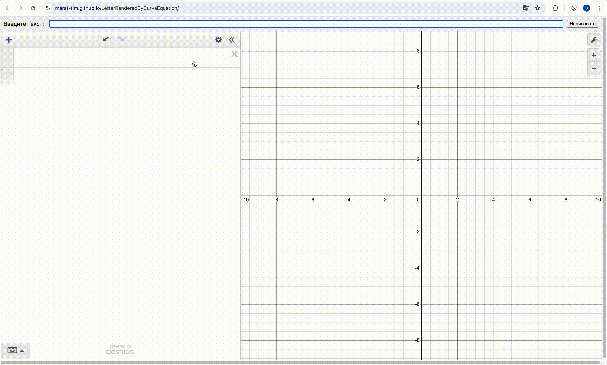

# Отрисовщик букв с помощью уравнения кривых

Вы можете попробовать приложение здесь - 
https://marat-tim.github.io/LetterRenderedByCurvaEquation/
(загрузка может занимать несколько секунд)

Приложение принимает на вход слово из разрешенных букв
(список разрешенных букв можно найти [здесь](./letter)).
Для каждой буквы в слове строится уравнение кривой, график которой
похож визуально на букву. 
Далее все графики добавляются на холст [Desmos][Desmos]
где можно увидеть как они выглядят и поиграться с ними

У приложения нет прикладного применения. 
Это просто прикольная математическая штука

Изначально был использован [pyscript](https://pyscript.net/) так как
на нем есть хорошая символьная математика [sympy](https://www.sympy.org/).
Однако pyscript очень тормозит при загрузке, а на некторых устройствах вообще
не загружается. Поэтому с помощью ИИ я переписал весь код на javascript.
К сожалению на js нет таких хороших библиотек как sympy, поэтому часть выражений 
упрощаются не совсем хорошо(например могут быть трех-этажные дроби)

Я веду список задач и ошибок 
[здесь](https://github.com/Marat-Tim/LetterRenderedByCurvaEquation/issues)

# Архитектура

Изначально проект нацелен на отрисовку в [Desmos][Desmos], 
в котором есть ряд проблем:

- Уравнение $\sqrt{x - 1} = 0$ не рисует вертикальную линию $x = 1$.
Из-за этого можно встретить выражения вида $(x - 1) \sqrt{x - 0.9} = 0$.
Первая скобка рисует прямую $x = 1$. Вторая ограничивает область возможных
значений $x \geq 0.9$. Почему $0.9$, а не $1$ объясняется в следующем пункте
- Почему-то $\sqrt{x - 1} = 0$ ограничивает область возможных значений как не
$x \geq 1$, а $x > 1$(строгое ограничение). Из-за этого уравнение 
$(x - 1) \sqrt{x - 1} = 0$ не отображает ничего на холсте. Чтобы это исправить 
надо немного "подвинуть" область ограничения под корнем. Для этого нужно переписать
уравнение так $(x - 1) \sqrt{x - 0.9} = 0$. Тогда прямая $x = 1$ будет видна. Но 
из такого многие буквы имеют "отростки" от своего нормального вида

[Desmos]: https://www.desmos.com/calculator
